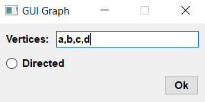
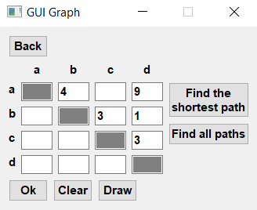
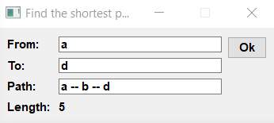
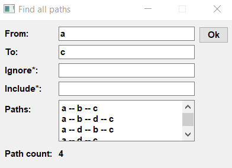

# GUI Graph

### Screenshots:
Vertices Input Menu

Table

Find the shortes path menu

Find all paths menu


### Requirements:
* python 3

### Installation
To install the project in your computer, run the following
```bash
git clone https://github.com/Kamil-Jan/GUI-Graph.git
cd GUI-Graph
pip install -r requirements.txt
```

### Usage
Open main.py. Enter the vertices separated by commas, click "Ok" or press "Enter", then fill the table

